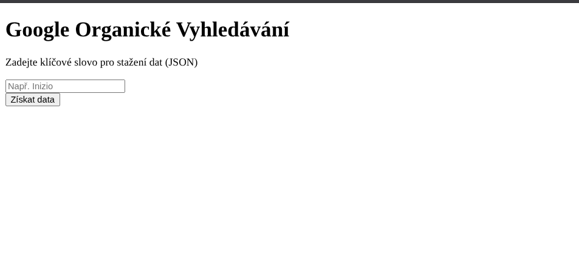

# Flask SEO Scraper

[](https://www.python.org/)
[](https://flask.palletsprojects.com/)
[](https://render.com/)
[](https://opensource.org/licenses/MIT)

> **"KISS v praxi: Od formuláře k JSONu na jedno kliknutí."**

Jednoduchá webová aplikace, která umožňuje získat organické výsledky vyhledávání z první strany Google a stáhnout je ve strukturovaném formátu (JSON).

## Kontext a Účel

Projekt vznikl jako vypracování **technického zadání pro výběrové řízení**.
Cílem bylo demonstrovat schopnost propojit frontend (HTML formulář), backend (Flask), externí API (SerpApi) a automatizované testování v jeden funkční celek nasazený v cloudu.

---

## Živá ukázka (Live Demo)

Aplikace je nasazena na cloudu **Render.com**.
_Odkaz na běžící aplikaci zde přímo není sdílen z důvodu ochrany limitů API klíče._

> **⚡ Cold Start Upozornění:** Server běží na "Free Tier" instanci. Pokud je aplikace chvíli neaktivní, server se uspí. **První načtení může trvat cca 50-60 vteřin.** Další požadavky jsou již okamžité.

---

## Workflow a Architektura

Aplikace funguje na principu "Input → Process → Download".

```text
┌──────────────┐     ┌──────────────┐    ┌──────────────┐    ┌──────────────┐
│1. Uživatelský│───▶ │  2. Flask    │───▶│  3. SerpApi  │───▶│  4. Export   │
│   Vstup      │     │     Backend  │    │     Google   │    │     JSON     │
└──────────────┘     └──────────────┘    └──────────────┘    └──────────────┘
```

## 📂 Struktura projektu

```text
flask-seo-scraper/
├── docs/
│   └── images/         # Screenshoty pro dokumentaci
├── templates/
│   └── index.html      # Frontend (HTML formulář)
├── tests/
│   └── test_scraper.py # Unit testy (mockování API)
├── app.py              # Hlavní Flask aplikace (Controller)
├── scraper.py          # Logika stahování dat (Model)
├── requirements.txt    # Závislosti pro deployment
├── .env                # API klíče (nejsou v repozitáři)
├── LICENSE
└── README.md
```

---

## Použité technologie

| Komponenta     | Technologie            | Účel                                             |
| :------------- | :--------------------- | :----------------------------------------------- |
| **Backend**    | Python 3 + Flask       | Minimalistický server pro obsluhu požadavků.     |
| **Data**       | SerpApi                | Stabilní a legální získávání dat z Google SERP.  |
| **Bezpečnost** | python-dotenv          | Správa API klíčů (oddělení konfigurace od kódu). |
| **Testování**  | pytest + unittest.mock | Ověření logiky bez nutnosti volat externí API.   |
| **Deploy**     | Render.com             | Gunicorn server pro produkční nasazení.          |

## Ukázka rozhraní



---

## Jak spustit projekt lokálně

**1. Naklonujte repozitář:**

```bash
git clone https://github.com/painter99/inizio_ukol.git flask-seo-scraper
cd flask-seo-scraper
```

**2. Vytvořte a aktivujte virtuální prostředí:**

```bash
python3 -m venv .venv
source .venv/bin/activate  # Linux/Mac
# .venv\Scripts\activate  # Windows
```

**3. Nainstalujte závislosti:**

```bash
pip install -r requirements.txt
```

**4. Nastavte proměnné prostředí:**
Vytvořte soubor `.env` v kořenovém adresáři a vložte svůj API klíč:

```text
API_KEY=klic_ze_serpapi
```

**5. Spusťte aplikaci:**

```bash
python app.py
```

Aplikace poběží na `http://127.0.0.1:5000`.

---

## Testování

Projekt obsahuje unit test, který ověřuje logiku parsování dat. Využívá **mocking**, takže při testování nedochází k čerpání kreditů z API.

```bash
python -m pytest
```
